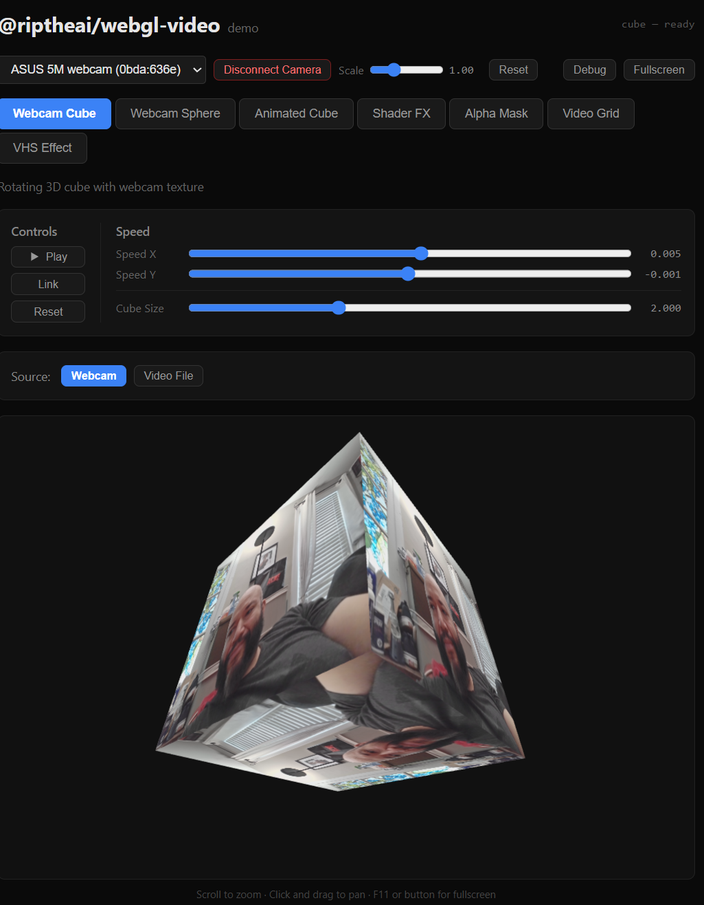
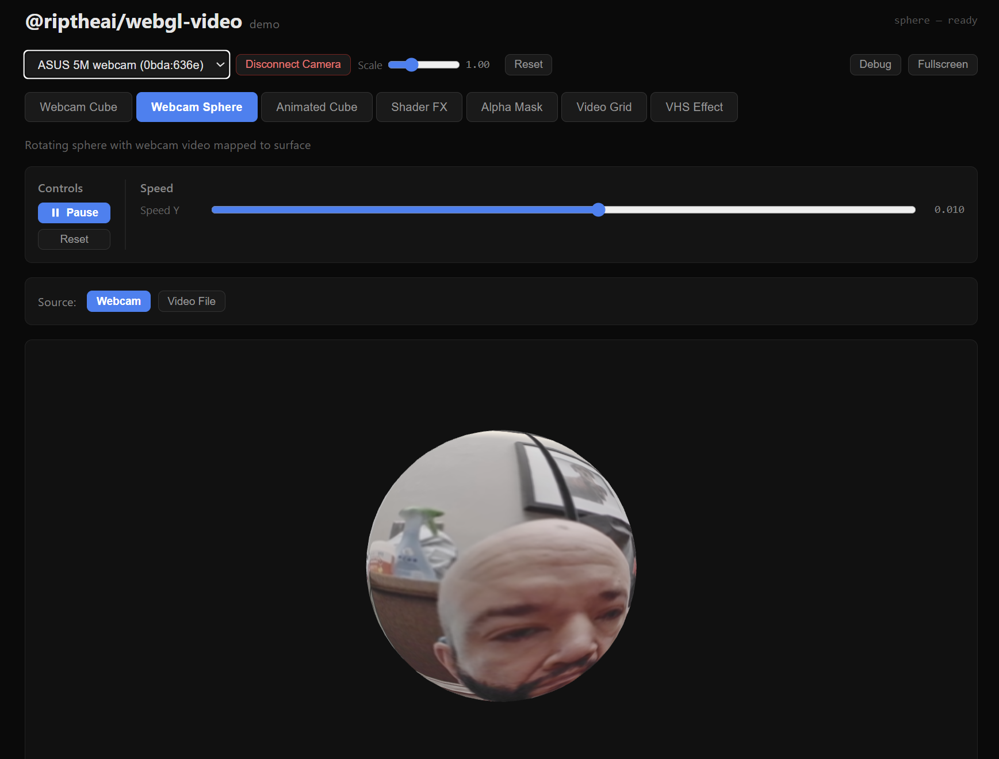
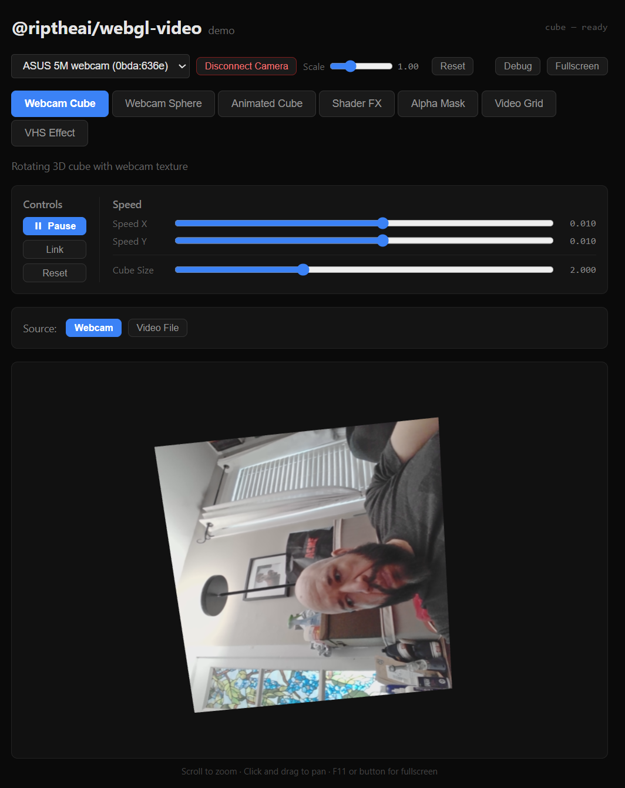

# @riptheai/webgl-video

Three.js WebGL video texture components for React — webcam cubes, spheres, shader effects, VHS retro filters, video grids, and tile animations.

<p align="center">
  
  
  
</p>

## Install

```bash
npm install @riptheai/webgl-video three react react-dom
```

## Components

| Component | Description |
|---|---|
| `WebcamCube` | Rotating 3D cube with webcam/video texture on each face |
| `WebcamSphere` | Rotating sphere with video mapped to the surface |
| `AnimatedVideoCube` | Cube with configurable rotation, surprise animation, and debug overlay |
| `VideoShaderFX` | Video feed processed through custom GLSL vertex/fragment shaders |
| `VideoAlphaMask` | Video composited with a separate alpha mask video |
| `VideoVHSEffect` | Retro VHS filter with scanlines, chromatic aberration, noise, and tracking glitch |
| `VideoGrid` | NxN tile grid with 12 built-in animations and adjustable spacing/tilt |
| `VideoGridControls` | Standalone control panel for VideoGrid parameters |

All components support both **webcam** and **video file** input via the `mediaStream` and `videoSrc` props.

## Quick Start

```tsx
import { WebcamCube } from '@riptheai/webgl-video';

function App() {
  return (
    <WebcamCube
      width={640}
      height={480}
      rotationSpeed={{ x: 0.01, y: 0.01 }}
      onReady={() => console.log('WebGL ready')}
      onError={(err) => console.error(err)}
    />
  );
}
```

### Shared Webcam Stream

For apps with multiple components, acquire the stream once and share it to avoid device lock issues:

```tsx
const [stream, setStream] = useState<MediaStream | null>(null);

useEffect(() => {
  navigator.mediaDevices.getUserMedia({ video: true }).then(setStream);
  return () => stream?.getTracks().forEach(t => t.stop());
}, []);

return (
  <>
    <WebcamCube mediaStream={stream} width={400} height={400} />
    <WebcamSphere mediaStream={stream} width={400} height={400} />
  </>
);
```

### Video File Input

```tsx
<VideoShaderFX
  videoSrc={URL.createObjectURL(file)}
  width={640}
  height={480}
  onVideoElement={(el) => { /* control playback: el.pause(), el.currentTime = 0, etc. */ }}
/>
```

### Next.js (App Router)

Components use WebGL and `navigator.mediaDevices`, so they must be client-rendered:

```tsx
import dynamic from 'next/dynamic';

const WebcamCube = dynamic(
  () => import('@riptheai/webgl-video').then((m) => m.WebcamCube),
  { ssr: false }
);
```

## Base Props

All components extend `BaseWebGLVideoProps`:

| Prop | Type | Default | Description |
|---|---|---|---|
| `width` | `number` | varies | Canvas width in pixels |
| `height` | `number` | varies | Canvas height in pixels |
| `className` | `string` | — | CSS class on outer container |
| `style` | `CSSProperties` | — | Inline styles on outer container |
| `selectedDeviceId` | `string` | — | Specific webcam device ID |
| `mediaStream` | `MediaStream` | — | Pre-acquired webcam stream (skips getUserMedia) |
| `videoSrc` | `string` | — | Video file URL (blob URL or remote) |
| `onReady` | `() => void` | — | Fires when WebGL scene is initialized |
| `onError` | `(error: Error) => void` | — | Fires on init failure |
| `onVideoElement` | `(el: HTMLVideoElement \| null) => void` | — | Exposes internal video element for playback control |

## VHS Effect

```tsx
import { VideoVHSEffect } from '@riptheai/webgl-video';

<VideoVHSEffect
  width={640}
  height={480}
  intensity={1.0}          // Overall effect strength (0-2)
  scanlineIntensity={1.0}  // Scanline visibility (0-3)
  aberrationIntensity={1.0} // Chromatic aberration (0-5)
  noiseIntensity={1.0}     // Film grain noise (0-3)
  trackingGlitch={true}    // Periodic horizontal glitch band
/>
```

All VHS parameters are stored in refs — changing them via sliders updates the shader in real-time at 60fps without re-initializing the WebGL scene.

## Grid Animations

The `VideoGrid` component ships with 12 built-in tile animations accessible via the `animationTrigger` prop:

`spread_apart` · `flip_tiles` · `vortex_spiral` · `explode_fragments` · `wave_motion` · `scale_to_zero` · `cascade_fall` · `rotate_carousel` · `matrix_rain` · `bounce_physics` · `spiral_galaxy` · `domino_effect`

For programmatic control, import the animation engine directly:

```ts
import { GridAnimationController } from '@riptheai/webgl-video/animations';
```

## Utilities

```ts
import {
  createVideoTexture,   // VideoTexture with correct filtering + color space
  createWebcamStream,   // getUserMedia with retry/fallback (exact → preferred → any)
  createRenderer,       // WebGLRenderer attached to a container
  cleanupThreeScene,    // Dispose renderer, stop stream, cancel RAF
  waitForVideoReady,    // Promise that resolves when video has enough data for texture
} from '@riptheai/webgl-video';
```

## Development

```bash
git clone https://github.com/NooRotic/webgl-video-camera.git
cd webgl-video-camera
npm install
npm run dev          # Vite demo server on http://localhost:3333
npm run test         # Run unit tests (31 tests)
npm run typecheck    # TypeScript type checking
npm run build        # Build ESM + CJS + TypeScript declarations
```

## License

MIT

---

<p align="center">
  Built by <a href="https://github.com/NooRotic"><b>RipTheAI</b></a> · <a href="https://twitch.tv/riptheai">Twitch</a> · <a href="https://github.com/NooRotic/webgl-video-camera">GitHub</a>
</p>
